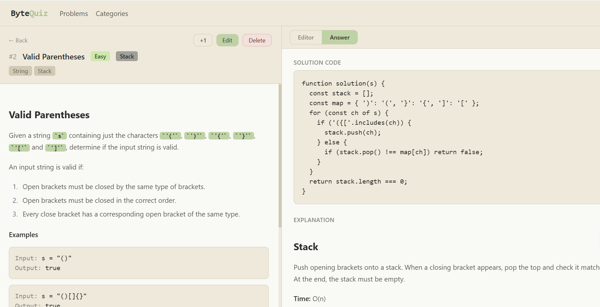

<div align="center">


  <!-- <h1>ByteQuiz</h1> -->
  <p><strong>A self-hosted coding interview practice platform</strong></p>
  <p>Practice algorithms, SQL, system design — all in one place.</p>
</div>

<div align="center">


</div>

---

## Preview



---

## Features

| | |
|---|---|
| ⚡ Monaco Editor | VS Code-grade editor in the browser |
| 🗂 Custom Categories | Add, edit, and delete categories with custom colors |
| 👁 Instant Answers | View solutions without submitting |
| ✏️ Full CRUD | Add, edit, delete problems via UI |
| 🔍 Smart Filters | Filter by difficulty, category, tags |
| 💾 Local First | No cloud, no account, runs on SQLite |
| 🤖 AI Grading | Submit code to get instant feedback from GPT-4.1 — logic errors, syntax issues, and fix suggestions |

---

## Tech Stack

**Frontend**


**Backend**


**Database**


---

## Getting Started

### Prerequisites

- **Node.js** >= 18 — [Download](https://nodejs.org)
- **Git**

### Installation

```bash
# 1. Clone the repo
git clone https://github.com/andrewyang0620/ByteQuiz.git
cd ByteQuiz

# 2. Install all dependencies
cd client && npm install
cd ../server && npm install

# 3. Start development servers
# Terminal 1 — backend
cd server && npm run dev

# Terminal 2 — frontend
cd client && npm run dev
```

| Service  | URL                          |
|----------|------------------------------|
| Frontend | http://localhost:5173         |
| API      | http://localhost:3001/api     |

> **Production (single process):** Build the client (`npm run build` in `client/`), then run `npm run build && node dist/index.js` in `server/`. Everything is served from one Express process.

---

## Project Structure

```
bytequiz/
├── client/                 # React frontend (Vite)
│   └── src/
│       ├── components/     # Reusable UI components
│       ├── pages/          # Route-level pages
│       └── api/            # Axios API client
├── server/                 # Express backend
│   └── src/
│       ├── routes/         # API route handlers
│       ├── db/             # Schema, seed data
│       └── executor/       # Code runner (vm sandbox)
├── README.md
└── package.json            # Root scripts
```

---

## Usage

- **Add problems** — click `+ Add Problem`, fill in title, category, description, and optional examples / test cases
- **Practice** — open any problem, write code in the Editor tab, hit `▶ Run` to test against saved test cases
- **AI Grading** — click `▶ Submit` to send your code to GPT-4.1 for instant feedback: logic errors with line-by-line fixes and format/syntax issues
- **View answer** — switch to the **Answer** tab in the right panel
- **Track progress** — hit `+1` on any problem to track how many times you've practiced it
- **Manage categories** — go to **Categories** to add, edit (name + color), or delete categories

---

## AI Grading Setup

ByteQuiz uses OpenAI GPT-4.1 to review your code submissions.

1. Add your API key to `server/.env`:
   ```
   OPENAI_API_KEY=sk-...
   ```
2. Rebuild and restart the server:
   ```bash
   cd server && npm run build && pm2 restart bytequiz-server
   ```
3. Open any problem, write code, and click **▶ Submit** — the **AI Grading** tab will show feedback structured as:
   - 🔴 **Logic Errors** — line-level issues with suggested fixes
   - 🟡 **Format / Syntax Errors** — typos, naming violations, syntax mistakes

> The output language defaults to English. To switch to Chinese, change `OUTPUT_LANGUAGE` in `server/src/routes/grade.ts` line 5 to `'zh'`, then rebuild.

---

## Contributing

Contributions are welcome!

1. Fork the repo
2. Create your branch: `git checkout -b feat/your-feature`
3. Commit your changes: `git commit -m 'feat: add some feature'`
4. Push and open a PR

To add new built-in problems or categories, edit `server/src/db/seed.ts`.

---

## License

MIT © 2025 — feel free to fork and self-host.
- Add your own problems with full Markdown support
- Create custom categories (SQL, system design, etc.)
- Zero external dependencies - runs fully on your machine

## Tech Stack

| Layer    | Technology                               |
|----------|------------------------------------------|
| Frontend | React + Vite + TypeScript + Tailwind CSS |
| Backend  | Node.js + Express + TypeScript           |
| Database | SQLite (node:sqlite built-in)            |
| Editor   | Monaco Editor                            |

## Getting Started

### Prerequisites
- Node.js >= 22.5

### Install & Run
```bash
git clone https://github.com/andrewyang0620/ByteQuiz.git
cd ByteQuiz
npm run install:all
npm run dev
```

- Frontend: http://localhost:5173
- Backend API: http://localhost:3001

## Project Structure

```
bytequiz/
|-- client/          # React frontend
|-- server/          # Express backend
|   -- data/        # SQLite database (gitignored)
-- README.md
```

## Adding Problems

Click **"+ Add Problem"** in the nav bar to add a problem via the UI,
or seed the database directly via server/src/db/seed.ts.

## Managing Categories

Go to **Categories** in the nav bar to add or remove custom categories.
Built-in categories (Array, SQL, etc.) cannot be deleted.

## License

MIT
